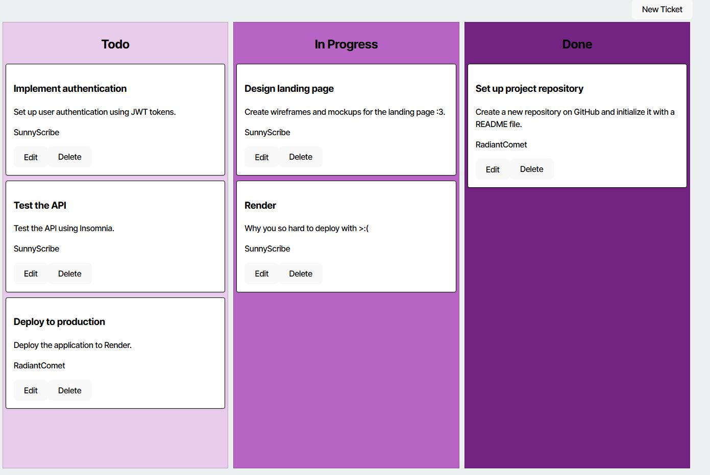

# Kanban Board 

## Description
This Kanban app is used to generate Todos, In Progres, and Done lists. Use the link below to be directed to the webpage. As this is an excercise for JWT principles, the logins are premade. To obtain the demo Username and Password, navigate to the "seeds" directory and select a user from the "user-seeds.ts" file. Pleae note that personal user accounts cannot be made. If you wish to do so, please fork the repo, install the dependencies, and enter your desired credentials in the seed files.

[Kanban Page](https://kanban-board-mrxh.onrender.com)

## Table of Contents
- [Installation](#installation)
- [Usage](#usage)
- [Contributing](#contributing)
- [Tests](#tests)
- [Questions](#questions)
- [License](#license)

## Installation
No installation just visit the website!
[Kanban Page](https://kanban-board-mrxh.onrender.com)

## Usage
This project is for demonstration purposes for JWT implementation.

## License
This project is licensed under the MIT license.
[MIT](https://opensource.org/licenses/MIT)

## Contributing
Mark Sianipar

## Tests
N/A

## Questions
If you have any questions, please feel free to contact me at MarkSianipar@gmail.com. You can also find me on GitHub at [MarkSianipar@gmail.com ]